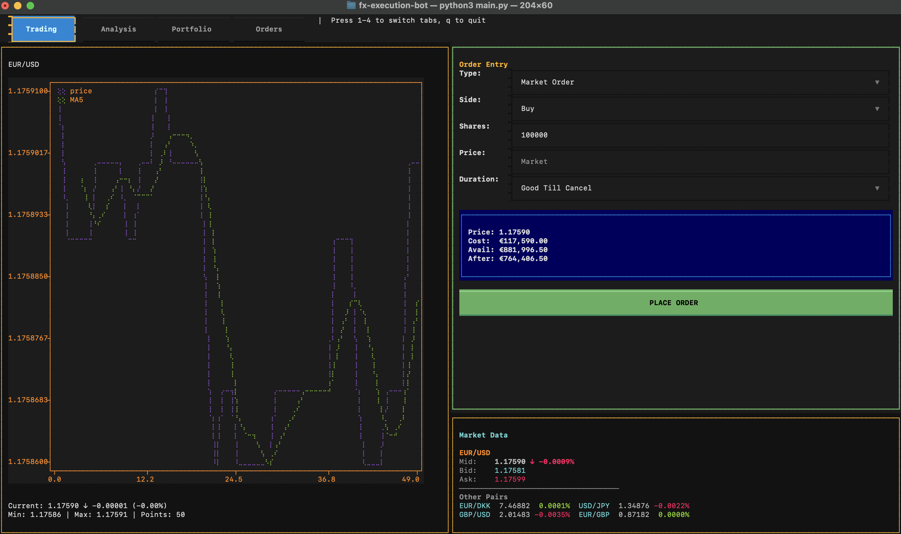

# FX Trading Terminal

A Python-based trading bot that interacts with the Saxo Bank OpenAPI to fetch live FX spot prices, monitor account balances, manage positions, and 
place orders. 



The system leverages an Abstract Base Class architecture to seamlessly toggle between real-time SAXO-API data and delayed Yahoo Finance feeds. To ensure performance, asynchronous worker threads handle real-time market datawhile the main thread handles the TUI and user input. Simultaneously, a dedicated Order Monitor thread validates active orders against live price feeds, automatically triggering execution upon hitting price targets. Users can execute Market and Limit orders across various FX pairs and track their portfolio performance in real-time.


## Key Controls:
q : Quit  
1 : Trading Terminal - Execution  
2 : Analysis - Technical Indicators.  
3 : Portfolio - Positions & PnL.  
4 : Orders - Working Orders.  
 
> [!TIP]
> Saxo API: Saxo Bank OpenApi for live execution and real-time institutional pricing.  
> YahooFinance data: market data fetched via Yahoo Finance with 1-minute granularity

### **Installation**
```bash

git clone <repository-url>
cd fx-execution-bot
pip install -r requirements.txt
python main.py
```


# Notes

- Simplified execution model treats FX pairs as cash assets (1:1 leverage) rather than margin instruments to ensure strictly bounded risk profiles.

- Long-Only(Buy-to-Open, Sell-to-Close), No Shorts

- The order monitor thread checks every order linearly O(N), could be improved with max-heap to check the largest price O(1), and a min-heap to check the lowest price O(1).

- Yahoo Finance data feeds hold a 0–60 second latency due to 1-minute candle aggregation

- A portion of UI part of the python code(textual), how to get input and show output, was coded with the feedback of Google gemini

